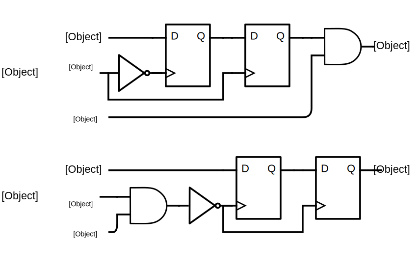

#HW4 Deliverables
####Nur Shlapobersky

##Deliverable 1

##Deliverable 6

The `<<` operator in verilog is a logical shift left which shifts all the bits of the operand one significant bit higher.
The purpose of the decoder is to enable writing to a given register, so it must pass a `HIGH` enable value to a given bit of the output.
Shifting enable by `address` amount of bits will cause `enable`'s value to be passed to the appropriate bit of `out`. For instance, if
`address` is `0d3`, it will cause `enable`'s value to be shifted over 3 bits, placing it in the 3rd bit (starting from the 0th) of `out`.