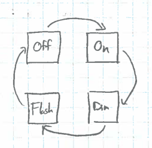

#Midterm // Four-mode Bike Light
####Nur Shlapobersky

##Specifications

#####Inputs
Raw button input

#####Outputs
LED output

####Operational Modes

The bike light has four distinct operational modes:

**Off**: In which the LED is being suplied with no power.

**On**: In which the LED is being provided with constant power.

**Dim**: In which the LED is supplied with a 64Hz signal at a 50% duty cycle. Since this blink rate is faster than that discernible by the human eye, it creates the effect of a dimmer light.

**Flashing**: In which the LED is supplied with a 2Hz signal at a 50% duty cycle.

The following diagram represents the different light modes:

The transition between these four modes is controlled by a finite state machine that can be represented by the diagram below. Each arrow represents a button press:

##Block Diagram
Below is a high-level block diagram of the four-mode bike light:

#####Total Size
Subcomponent | Cost per | # | Total
---|---|---|---
Input Conditioner | 95 | 1 | 95
System Clock | 2 | 1 | 2
Frequency Divider | 13 | 14 | 182
Finite State Machine | 52 | 1 | 52
4x1 Multiplexer | 19 | 1 | 19

For a total cost of **350**

##Schematics

###Input Conditioner
The input conditioner has two purposes. One is to effectively ignore input glitches of under 1 microsecond, and the second is to detect positive edges of the input.

######Inputs
External Button

Slowed clock from the x5 Frequency Divider

######Outputs
Positive edge of button press

######Schematic

######Size
Subcomponent | Cost per | # | Total
---|---|---|---
DFF | 13 | 5 | 65
2x1 Mux | 10 | 2 | 20
2AND | 3 | 1 | 3
2OR | 3 | 1 | 3
2XOR | 3 | 1 | 3
Inverter | 1 | 1 | 1

For a total cost of **95**

###Frequency Divider
The frequency divider is used to slow down the frequency of a clock. It can be chained multiple times to divide the frequency by 1/2 for each one.

######Inputs
Clock

######Outputs
1/2 frequency clock

1/2 frequency inverted clock (for chaining to multiple frequency dividers)

######Schematic

######Size
Subcomponent | Cost per | # | Total
---|---|---|---
DFF | 13 | N | 13*N
Since we use a total of 14 frequency dividers, the total cost is  **182**

###Finite State Machine
The finite state machine is used to cycle between the different modes of the LED.

######Inputs
Conditioned positive edge of button input

System Clock

######Outputs
2-bit Multiplexer control signal

######Schematic

######Size
Subcomponent | Cost per | # | Total
---|---|---|---
DFF w/ Enable | 20 | 2 (Because the flip-flop holds 2 bits) | 40
Adder | 12 | 1 | 12

For a total cost of **52**

###Adder
The adder is used by the finite state machine to increment from one state to the next.

######Inputs
State-holding DFF/E

######Outputs
State-holding DFF/E

######Schematic

######Size
Subcomponent | Cost per | # | Total
---|---|---|---
2AND | 3 | 1 | 3
2XOR | 3 | 1 | 3
3XOR | 6 | 1 | 6

For a total cost of **12**
